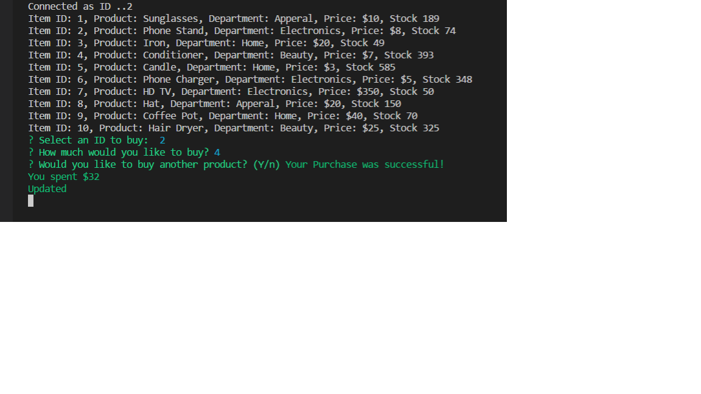

# Bamazon

## Overview

In this activity, you'll be creating an Amazon-like storefront with the MySQL skills you learned this week. The app will take in orders from customers and deplete stock from the store's inventory. As a bonus task, you can program your app to track product sales across your store's departments and then provide a summary of the highest-grossing departments in the store.

## Dependencies

    Inquirer
    MySql

## Functionality

The app should then prompt users with two messages.

   * The first should ask them the ID of the product they would like to buy.
   * The second message should ask how many units of the product they would like to buy.

Once the customer has placed the order, the application should check if your store has enough of the product to meet the customer's request.

  ##Screenshots

  
  

   
